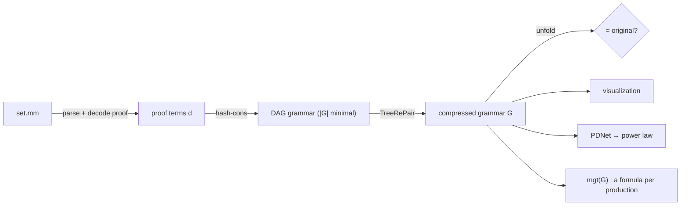
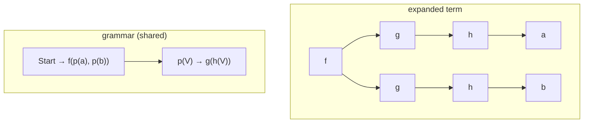
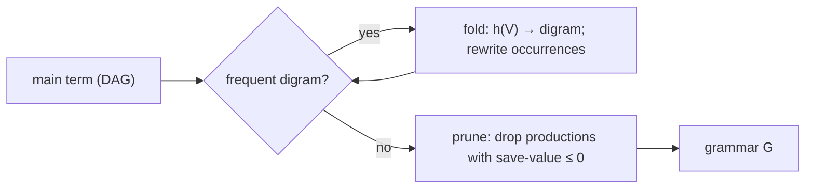
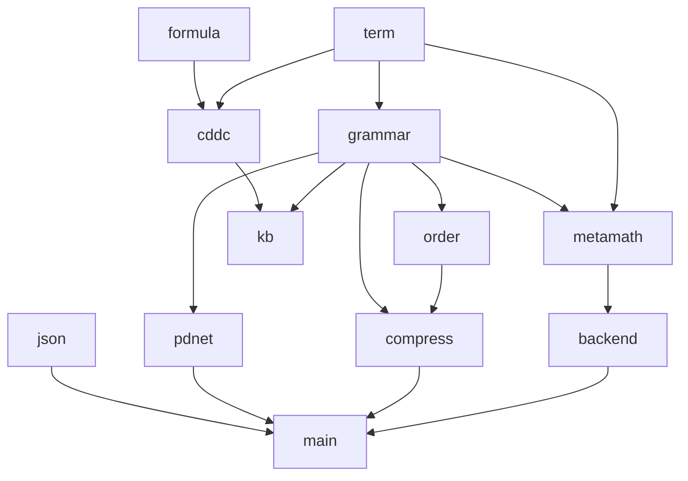

# mini-math

A faithful, minimal **OCaml** reimplementation of the core of

> C. Wernhard & Z. Zombori, *Mathematical Knowledge Bases as Grammar-Compressed Proof Terms.*

Thesis of the paper, in one line:

> **A knowledge base is just a grammar that compresses a set of gigantic proof trees.**

`mini-math` parses [`set.mm`](https://github.com/metamath/set.mm), turns each proof into a **proof term**, compresses the set of terms into a small **tree grammar**, checks the compression is **lossless**, and ships an interactive **visualization** (trie / proof tree / DAG / power-law).

---

## Pipeline



---

## 1. Proof terms

Two primitive inference rules (Metamath, via condensed detachment):

- **D** — *condensed detachment* = modus ponens + most general unifier.
- **G** — *condensed generalization* = quantifier introduction.

A **proof term** $d$ is a tree built from those constructors and **presupposition names** (axioms / already-proven lemmas) as leaves. Parameters $V_i$ stand for essential hypotheses.

The key move: shared subtrees become **nonterminals with parameters**. Paper's example —

$$f(g(h(a)),\, g(h(b))) \quad\Longrightarrow\quad \{\, p(V) \to g(h(V)),\ \ \mathrm{Start} \to f(p(a), p(b)) \,\}$$



A parameter-free nonterminal = plain **DAG** sharing; a parametrized one = genuine **tree-grammar** factoring.

---

## 2. CDDC & the most general theorem (MGT)

Formulas are **definite clauses** over one predicate `provable`:

$$A \leftarrow B_1 \wedge \dots \wedge B_n, \qquad n \ge 0.$$

The inference system **CDDC** defines $d : F$ (“proof term $d$ proves formula $F$”) with two rules:

- **App** — apply a presupposition to argument proofs, unifying premises with conclusions (mgu).
- **Par** — a parameter $V_i$ proves a fresh hypothesis $B_i$.

The **MGT** is the most general $F$ derivable for $d$:

$$\operatorname{mgt}_{\mathcal B}\big(d[V_1,\dots,V_k]\big) \;=\; A \leftarrow B_1 \wedge \dots \wedge B_k .$$

**Condensed detachment** is the special case of **App** with the implication axiom: from $s : (B \to A)$ and $t : B$, derive $A$ under the mgu of the two $B$'s.

→ `lib/cddc.ml` (`mgt`), `lib/formula.ml` (unify, α-equivalence).

---

## 3. Compression

Size measures:

$$|d| = \#\{\text{function nodes in the expanded term}\}, \qquad |G| = \sum_{(p \to r)\in G} |r|.$$

### 3a. DAG (`Compress.dag_compress`)
Hash-consing → one node per distinct subterm. Minimal **parameter-free** grammar.

### 3b. TreeRePair (`Compress.treerepair`)
Re-Pair for trees. A **digram** is a parent/child pattern

$$f(V_1,\dots,\, g(V_i,\dots,V_{i+m}),\, \dots,V_{n-1+m})$$

with $n-1+m$ parameters. Two phases:



- **replacement** — repeatedly replace the most frequent digram by a fresh production $h$.
- **pruning** — remove productions whose **save-value** $\le 0$ (originals are protected via `~protect`).

### 3c. Further reductions (paper Sect. 5–6)
- **nonlinear** — merge parameters that always receive equal arguments (linear → nonlinear grammar).
- **same-value** — collapse nonterminals with identical expanded value.

→ `lib/grammar.ml` (`size`, `save_value`), `lib/order.ml` (topo sort + prune), `lib/compress.ml`.

**Lossless check:** unfold every machine lemma in `G` and compare to the original human proof terms.

```bash
dune exec bin/main.exe -- verify 2000
# verify: N/N original proofs reproduced exactly after unfolding K lemmas
```

---

## 4. Proof Dependency Network (PDNet)

Nodes = theorems; weighted edges = “used in proof of”. In-degree (how often a theorem is reused) is heavy-tailed; the CCDF $P(X \ge k)$ is near-linear in log–log = **power law**.

→ `lib/pdnet.ml` (`of_grammar`, `ccdf`), rendered in the **In-degree** view.

---

## 5. Architecture



| module | role |
|---|---|
| `term.ml` | hash-consed proof terms (DAG), `size` |
| `formula.ml` | clauses, substitution, **unify**, α-equivalence |
| `cddc.ml` | CDDC inference, **MGT** |
| `grammar.ml` | productions, `|G|`, ref-count, **save-value** |
| `order.ml` | topological order + TreeRePair pruning |
| `compress.ml` | **DAG** + **TreeRePair** |
| `pdnet.ml` | dependency network + **CCDF** |
| `metamath.ml` | `set.mm` tokenizer + compressed-proof decoder + proof-term extraction |
| `backend.ml` | source-agnostic backend (Metamath; Lean stub) |
| `json.ml` | tiny JSON writer for the viz |

---

## How to run

**0. Prerequisites** — OCaml + dune, and Python 3 (only to serve the viz).

```bash
# Fedora
sudo dnf install -y ocaml ocaml-dune
# Debian/Ubuntu
sudo apt install -y ocaml dune
# macOS (Homebrew)
brew install ocaml dune
```

**1. Build**

```bash
dune build
```

**2. (optional) Run the tests** — pins the paper's worked examples ($|d| = 10$, $|G|_{\text{DAG}} = 8$, $|G|_{\text{TRP}} = 7$).

```bash
dune test
```

**3. Get `set.mm`** — downloads the pinned commit `8cf01a7` into `data/set.mm` (~46 MB; git-ignored).

```bash
dune exec bin/main.exe -- fetch
# or point at your own file later via the [path] arg
```

**4. Parse + compress** — writes `visualization/data/data.json` (already committed, so you can skip to step 6 to just look). The number is how many theorems to ingest.

```bash
dune exec bin/main.exe -- export 2000
```

**5. (optional) Prove it's lossless** — unfolds every machine lemma and checks it reproduces the original proofs exactly.

```bash
dune exec bin/main.exe -- verify 2000
```

**6. View the visualization** — serve the folder, then open the URL.

```bash
cd visualization
python3 -m http.server 8765
# now open http://localhost:8765 in a browser
```

### CLI summary

| command | what it does |
|---|---|
| `dune exec bin/main.exe -- fetch [url] [path]` | download `set.mm` (defaults: pinned commit → `data/set.mm`) |
| `dune exec bin/main.exe -- export [limit] [path]` | parse a fragment, compress, write `visualization/data/data.json` |
| `dune exec bin/main.exe -- verify [limit] [path]` | prove the compression is lossless (unfold lemmas == original proofs) |

---

## Visualization

After `export`, serve the `visualization/` folder (step 6 above) and open `http://localhost:8765`.

| view | what |
|---|---|
| **Trie** | radix prefix-tree over theorem **names** (circles + char-labeled edges); click to expand, search highlights the path |
| **Proof Tree** | proof-dependency tree; each node is its **Metamath statement** rendered with real symbols (∀ ∃ → ¬ ↔ ∧ ∨), variables colored by typecode (setvar / wff / class) |
| **Proof DAG** | drawn proof DAG for one theorem |
| **Network** | local PDNet, node size ∝ in-degree |
| **In-degree** | CCDF in log–log (power law) |

Toggle **Human (set.mm)** vs **Machine (TreeRePair)** grammars to compare structurings.

---

## Status / limits

- Propositional + quantifier fragment of `set.mm` (the part expressible as condensed-detachment proof terms).
- Intermediate proof-step formulas show each label's own statement; per-subterm instantiated MGTs are not yet pretty-printed.
- **Lean/mathlib** backend is a stub: dependent type theory needs a translation to condensed detachment first (paper Sect. 7).
