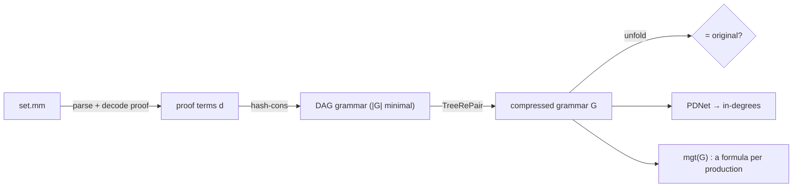
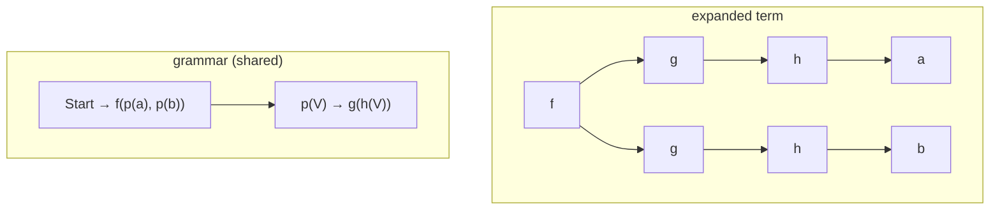
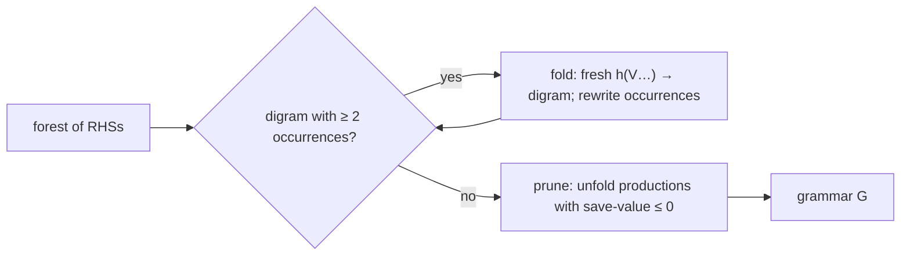
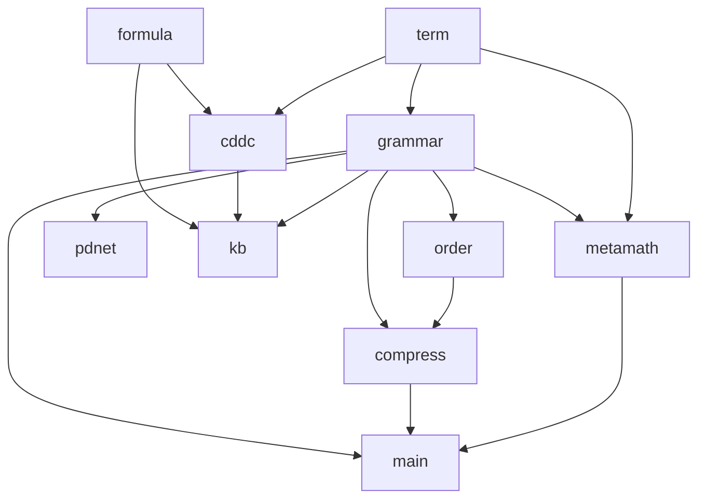

# mini-math

A minimal **OCaml** implementation of the core of

> C. Wernhard & Z. Zombori, *Mathematical Knowledge Bases as Grammar-Compressed Proof Terms: Exploring Metamath Proof Structures.* arXiv:2505.12305 — https://arxiv.org/abs/2505.12305

Thesis of the paper, in one line:

> A knowledge base is just a grammar that compresses a set of gigantic proof trees.

`mini-math` parses [`set.mm`](https://github.com/metamath/set.mm), turns each proof into a **proof term**, compresses the set of terms into a small **tree grammar**, checks that the compression is **lossless**, and reports grammar statistics in the style of the paper.

---

## Pipeline



---

## 1. Proof terms

Two primitive inference rules (Metamath, via condensed detachment):

- **D** — *condensed detachment* = modus ponens + most general unifier (`ax-mp`).
- **G** — *condensed generalization* = quantifier introduction (`ax-gen`).

A **proof term** $d$ (Def. 1) is a tree built from **presupposition names** (axioms / already-proven lemmas, with arity) and **parameters** $V_i$ standing for essential hypotheses. A term is *linear* if no parameter occurs twice.

The key move: shared subtrees become **nonterminals with parameters**. Paper's example —

$$f(g(h(a)),\, g(h(b))) \quad\Longrightarrow\quad \{\, p(V) \to g(h(V)),\ \ \mathrm{Start} \to f(p(a), p(b)) \,\}$$



A parameter-free nonterminal = plain **DAG** sharing; a parametrized one = genuine **tree-grammar** factoring.

---

## 2. CDDC & the most general theorem (MGT)

Formulas are **definite clauses** over one predicate `provable`:

$$A \leftarrow B_1 \wedge \dots \wedge B_n, \qquad n \ge 0.$$

The inference system **CDDC** defines $d : F$ ("proof term $d$ proves formula $F$") with two rules:

- **App** — apply a presupposition to argument proofs, unifying premises with conclusions (mgu). Constraints on the variables $u_i$ associated with parameters $V_i$ are merged across all occurrences.
- **Par** — a parameter $V_i$ proves the fresh hypothesis $u_i$.

The **MGT** (Def. 2) is the most general $F$ derivable for $d$:

$$\operatorname{mgt}_{\mathcal B}\big(d[V_1,\dots,V_k]\big) \;=\; A \leftarrow B_1 \wedge \dots \wedge B_k .$$

**Condensed detachment** is the special case of **App** with $\mathsf D :: y \leftarrow (x \Rightarrow y) \wedge x$.

For **nonlinear** proof terms the MGT of $d[d_1,\dots,d_k]$ can be strictly more general than what one gets by instantiating $\operatorname{mgt}(d)$ with the MGTs of the $d_i$ (Prop. 4, Example 5). This is pinned in the tests.

→ `lib/cddc.ml` (`mgt`, `mgt_k`), `lib/formula.ml` (`unify`, α-equivalence, `instance_of` = the paper's $F \mathrel{\dot\ge} F'$).

---

## 3. Grammars and compression

**Sizes.** $|d|$ is the number of **edges** of $d$ viewed as a tree: $|V_1| = |\mathsf{ax\text{-}1}| = 0$, $|\mathsf G(\mathsf{ax\text{-}1})| = 1$, $|\mathsf D(\mathsf G(\mathsf{ax\text{-}1}), \mathsf{ax\text{-}2})| = 3$. A production's size is the size of its RHS; $|G|$ is the sum over productions.

**Save-value.** For a production $p$ of $G$, let $G'$ be $G$ with $p$ removed and unfolded in every RHS. Then

$$\operatorname{sav}_G(p) = |G'| - |G|.$$

The closed form $\operatorname{ref}_G(p)\cdot(|d| - \operatorname{arity}(p)) - |d|$ holds only when every parameter of $p$ occurs exactly once in $d$; `Grammar.save_value` uses it as a fast path and falls back to the general definition otherwise. About a third of the productions of `set.mm` are nonlinear, so the general form matters.

### 3a. DAG (`Compress.dag_compress`)
Hash-consing → one node per distinct subterm; every subterm referenced more than once becomes an arity-0 production. Minimal **parameter-free** grammar (Example 6: $|G_1| = 8$).

### 3b. TreeRePair (`Compress.treerepair`)
Re-Pair for trees, run over the forest of all RHSs of a grammar (Sect. 6). A **digram** is the pattern

$$f(V_1,\dots,V_{i-1},\; g(V_i,\dots,V_{i+m-1}),\; V_{i+m},\dots,V_{n-1+m})$$

for a parent $f$ of arity $n$, a child $g$ of arity $m$ at argument position $i$; it has $n-1+m$ parameters. Two phases:



Original theorems are protected from pruning via `~protect`. Example 6: $|G_2| = 7$.

→ `lib/grammar.ml` (`size`, `ref_count`, `value`, `is_linear`, `save_value`), `lib/order.ml` (topological order, `prune`), `lib/compress.ml`.

**Lossless check:** unfold every new lemma and compare to the original human proof terms.

```bash
dune exec bin/main.exe -- verify 2000
# verify: N/N original proofs reproduced exactly after unfolding K lemmas
```

---

## 4. Knowledge bases (Defs. 7, 8)

The **grammar-MGT** (Def. 7) of a production is the MGT of its RHS against a base successively enriched with the grammar-MGTs of earlier productions; if any involved MGT is undefined, it is undefined for all. A **KB** (Def. 8) is a triple $\langle \mathcal B, \mathcal F, G\rangle$ with stated theorem formulas $F_i$ such that $F_i \mathrel{\dot\ge} \operatorname{shallow\text{-}mgt}_K(p_i)$, where the shallow-MGT enriches the base with the *stated* $F_j$ rather than computed MGTs. Metamath theorem statements may be *strict* instances of their shallow-MGT (about 8% in the paper's SetCore, O8).

→ `lib/kb.ml` (`grammar_mgts`, `shallow_mgts`, `is_kb`, `strict_instances`).

## 5. Proof dependency network (Def. 9)

Nodes = nonterminals; an edge $p \to q$ per occurrence of $q$ in the RHS of $p$. The in-degree of $q$ is $\operatorname{ref}_G(q)$.

→ `lib/pdnet.ml` (`of_grammar`, `in_degrees`).

---

## Architecture



| module | role |
|---|---|
| `term.ml` | hash-consed proof terms, `size` (= number of edges) |
| `formula.ml` | definite clauses, substitution, `unify`, α-equivalence, `instance_of` |
| `cddc.ml` | CDDC inference system, `mgt` / `mgt_k` (Def. 2) |
| `grammar.ml` | productions, `size`, `ref_count`, `value` (val_G), `is_linear`, `unfold_production`, `save_value` |
| `order.ml` | topological ordering (the $i < j$ invariant) and TreeRePair pruning |
| `compress.ml` | `dag_compress` (minimal DAG), `treerepair` (replacement + pruning over a forest of RHSs) |
| `kb.ml` | KB = ⟨B, F, G⟩; `grammar_mgts` (Def. 7), `shallow_mgts`, `is_kb`, `strict_instances` (Def. 8) |
| `pdnet.ml` | proof dependency network (Def. 9), in-degrees |
| `metamath.ml` | `set.mm` tokenizer, compressed-proof decoder, proof-term extraction, `load` |

---

## How to run

**Prerequisites** — OCaml (≥ 4.14) and dune (≥ 3.0).

```bash
# Fedora
sudo dnf install -y ocaml ocaml-dune
# Debian/Ubuntu
sudo apt install -y ocaml dune
# macOS (Homebrew)
brew install ocaml dune
```

**Build and test**

```bash
dune build
dune test
```

The tests pin the paper's worked examples: Example 3 (MGTs i–vii), Example 5 / Prop. 4 (grammar-MGT of a nonlinear production is a strict instance of the MGT of its expansion), Example 6 ($|d| = 10$, $|G_1| = 8$, $|G_2| = 7$, values preserved, DAG compression → 8, TreeRePair → 7), save-values of linear, nonlinear and LHS-only-parameter productions, the Def. 8 KB conditions, and PDNet in-degrees.

**Get `set.mm`** — downloads the commit used in the paper (`8cf01a7`) into `data/set.mm` (~46 MB, git-ignored).

```bash
dune exec bin/main.exe -- fetch
```

**Statistics** — parse the first `limit` theorems, print Table-2-style grammar statistics, then TreeRePair-compress the human grammar (original theorems protected) and list the top new lemmas by save-value (cf. paper App. B).

```bash
dune exec bin/main.exe -- stats 2000
```

**Lossless check**

```bash
dune exec bin/main.exe -- verify 2000
```

### CLI summary

`dune exec bin/main.exe -- <command>`

| command | what it does |
|---|---|
| `fetch [url] [path]` | download `set.mm` (defaults: paper's pinned commit → `data/set.mm`) |
| `stats [limit] [path]` | grammar statistics (\|G\|, N(G), ref / \|p\| / sav / arity distributions, % nonlinear), then compression summary and top new lemmas |
| `verify [limit] [path]` | check the compression is lossless (unfold lemmas == original proofs) |

`limit` defaults to 1000 theorems.

---

## Status / limits

- All `|-` theorems of the ingested prefix of `set.mm` become productions; syntactic (`wff`/`class`/`setvar`) proof steps are stripped, as in the paper.
- Metamath statements are not parsed into first-order clauses, so the $\mathcal F$ component of a KB for `set.mm` — and hence shallow-MGT / strict-instance statistics on `set.mm` — is not computed. `Kb` is exercised on the paper's examples in the tests.
- Not implemented (paper Sect. 5): nonlinear compression, same-value reduction, MGT-based reduction.
- Only Metamath is supported as a proof source.
